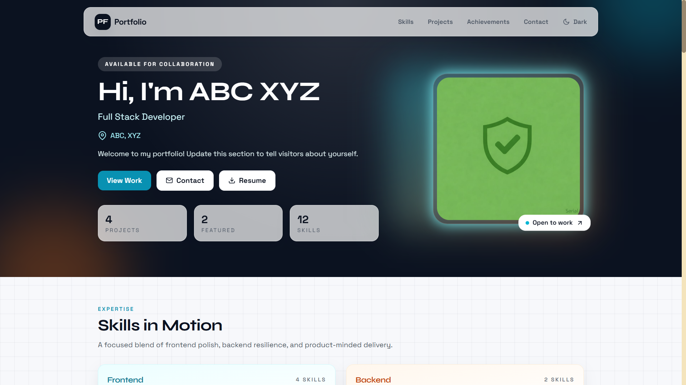
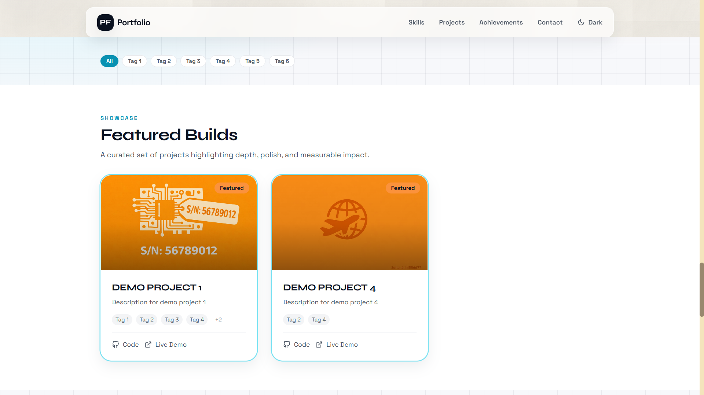
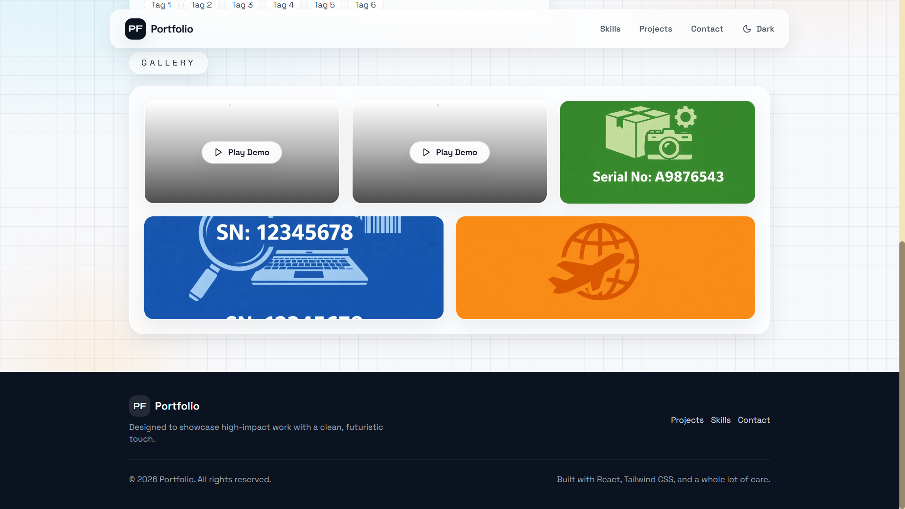
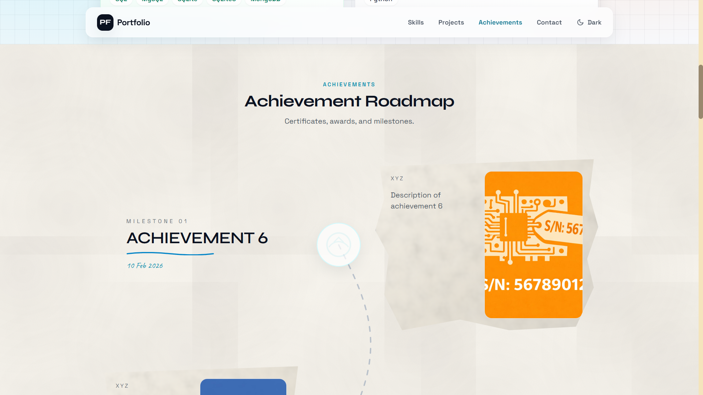
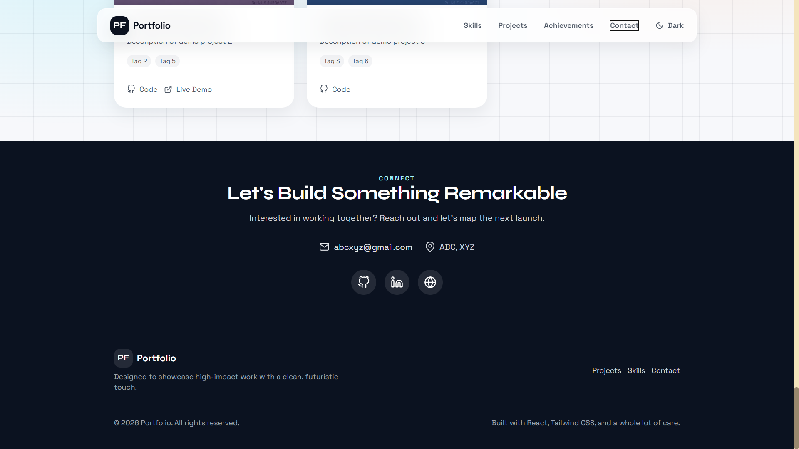

# P-Folio

Build a portfolio that looks premium, loads fast, and tells your story in seconds.



## The Short Pitch
P-Folio is a clean, conversion-focused portfolio experience designed to win attention quickly and keep it. Show your work, prove impact, and make it effortless for people to contact you.

## Why It Works
- Clear narrative that highlights results, not just tasks.
- Elegant layouts that keep projects and skills easy to scan.
- Fast, lightweight pages that feel professional on any device.
- Built-in structure for testimonials, case studies, and contact CTAs.

## What You Can Showcase
- Projects with outcomes, tools used, and your exact role.
- Case studies with before-and-after impact.
- Awards, certifications, and featured mentions.
- Services, availability, and engagement options.

## Designed For
- Developers and engineers
- Designers and product builders
- Freelancers and consultants
- Students and early-career professionals

## Highlights
- Beautiful, minimal layout that puts your work first.
- Sections that guide visitors from curiosity to contact.
- Space for custom branding and personal voice.
- Ready for hiring managers, clients, and collaborators.

## Gallery






## Contact Preview


## Get Started
1. Add your content and update section copy to match your voice.
2. Drop your images into `assets/`.
3. Replace any image with your own by updating the path.
4. Share your link and start getting replies.

## Swap Images
Use this pattern to replace images with your own:

```md

```

## Contact
Ready to collaborate or hire? Add your email, scheduling link, and social profiles here.
